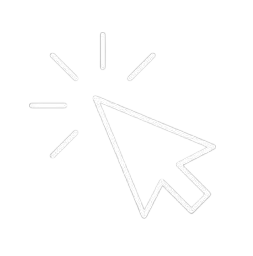
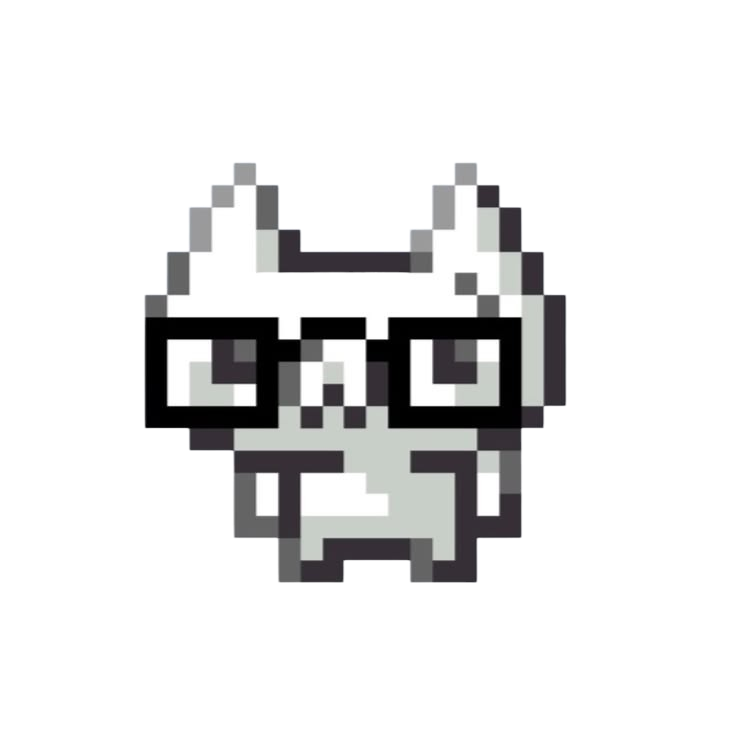
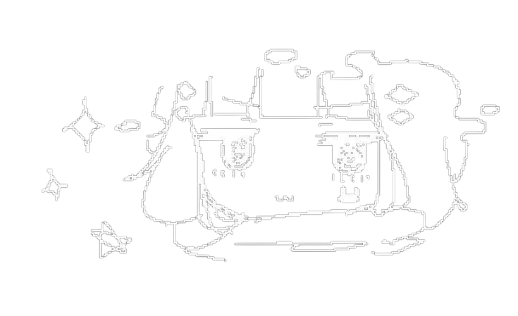

  <!-- Texto animado personalizado que va cambiando (centrado y un poco más grande) -->
  

 

---
<table border="0" align="center">
  <tr>
    <td width="480" valign="top">
      <pre>
<b>Microsoft Windows [Versión 10.0.22631]</b>
(c) Microsoft Corporation. Todos los derechos reservados.
      </pre>
      

        
<b>C:\Users\Gustavo&gt; cat sobre-mi.txt</b> 

         
        
          
      

      

        
<b>C:\Users\Gustavo&gt; dir proyectos\</b>

         
        

          <a href="https://portafolio-tan-five-55.vercel.app/" target="_blank">
            
             
            Visita mi portafolio (¡Haz clic en el gato!) 
          </a>
        

          
      

      

        
<b>C:\Users\Gustavo&gt; ping contacto -n 1</b>

         
        
          
      

    </td>
    <td width="320" valign="top" align="right">
        
      
    </td>
  </tr>
</table>
---

### Tech Stack

   
  
  
  
  
  
  
  
  
  
    

---

### Contáctame:

   &nbsp;
   &nbsp;
   &nbsp;
  

