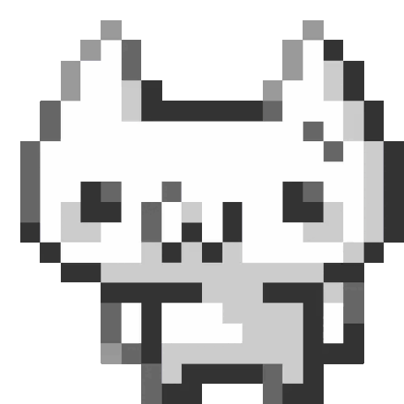
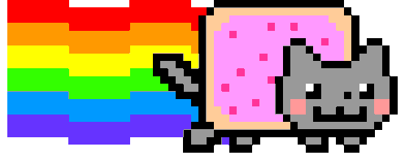
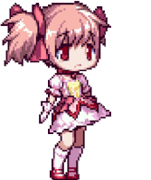
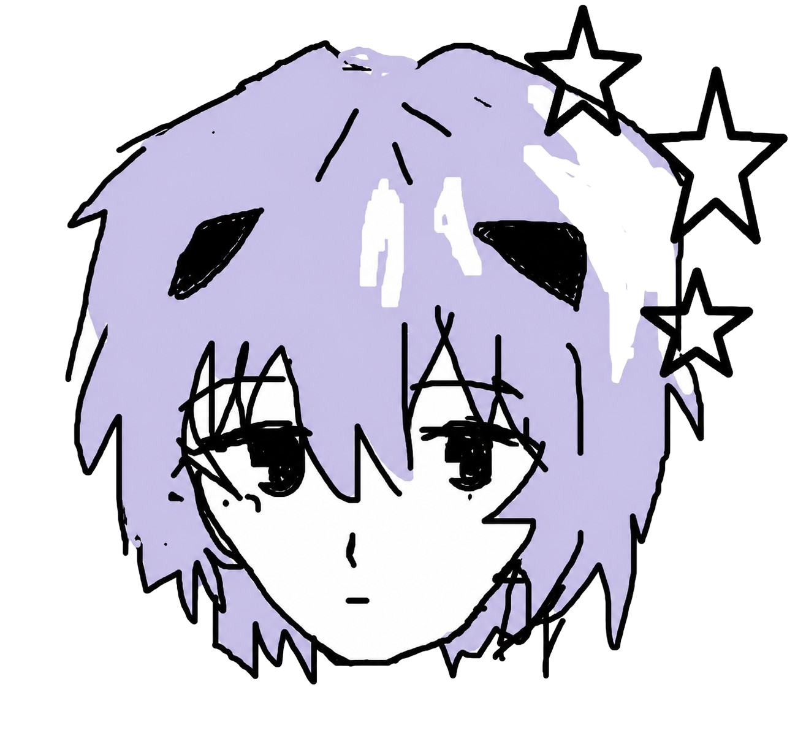

  <!-- Banner estilo Anime Retro / Y2K sacado de tus proyectos -->
  

 

  <!-- Texto animado como si fuera un inicio de sistema (Terminal Retro) -->
  

 

  <!-- Pequeño gif de tu carpeta de y2k -->
  

 

### ╭━━━━━━━━━━━━━━━ ✩ ━━━━━━━━━━━━━━━╮
### ✦ ＰＲＯＦＩＬＥ．ＥＸＥ ✦
### ╰━━━━━━━━━━━━━━━ ✩ ━━━━━━━━━━━━━━━╯

<!-- Usamos una tabla HTML para simular un pop-up o ventana antigua con imagen a la izquierda y texto a la derecha -->
<table align="center" style="border-collapse: collapse; border: 1px solid #444;">
  <tr>
    <td width="300" align="center" style="padding: 10px; border-right: 1px dashed #444;">
      <!-- GIF Decorativo que tenias en tu PC -->
      
    </td>
    <td width="500" style="padding: 20px;">
      
<b>[ LOADING DATA... ] 💿</b>

       
      
<b>> VIBE:</b> Estética Y2K, WebGL, Cyberpunk y Pixel Art.

      
<b>> CURRENT_MISSION:</b> Creando experiencias web 3D e interfaces nostálgicas.

      
<b>> LORE:</b> "Amo Japón, espero ir algún día 🌸"

      
<b>> PORTFOLIO:</b> <a href="https://portafolio-tan-five-55.vercel.app">Mi sitio web oficial</a>

       
      

        <!-- El logo que hiciste para tu portafolio -->
        
      

    </td>
  </tr>
</table>

 

### ╭━━━━━━━━━━━━━━━ ✩ ━━━━━━━━━━━━━━━╮
### ✦ ＳＫＩＬＬＳ．ＤＡＴ ✦
### ╰━━━━━━━━━━━━━━━ ✩ ━━━━━━━━━━━━━━━╯

  <!-- Botones de colores estilo Retro/Dark -->
  
  
  
  
  
  
  
  
  

 

### ╭━━━━━━━━━━━━━━━ ✩ ━━━━━━━━━━━━━━━╮
### ✦ ＳＴＡＴＳ．ＳＹＳ ✦
### ╰━━━━━━━━━━━━━━━ ✩ ━━━━━━━━━━━━━━━╯

  <!-- Tema 'synthwave' (Neon/Oscuro Y2K) -->
  

 
